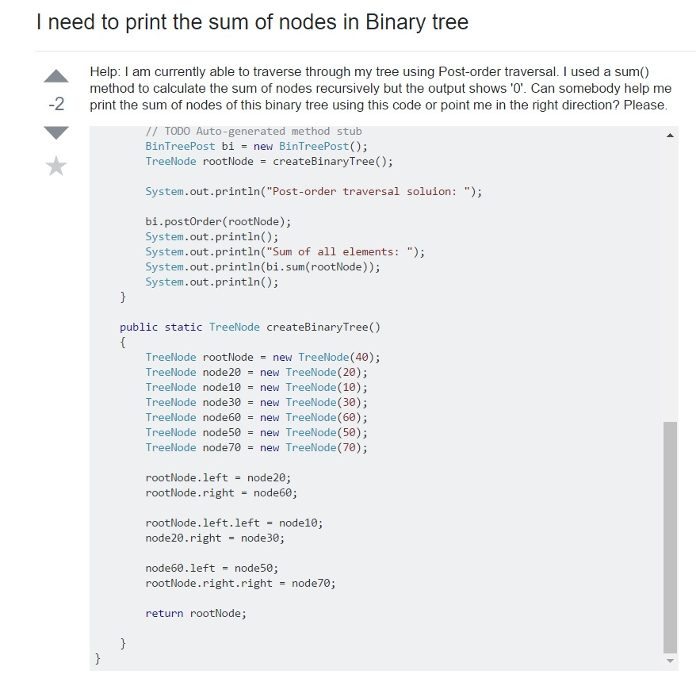

## Introduction 
Having questions especially when it comes to programming is very common thing. Sometimes it can be simple fixes like missing semicolon or 
it can be more complex ones which require more analysis of the code itself. Nevertheless, it can be frustrating when these issues appear andit can be beneficial to have a second opinion from someone else. A common step people such as myself would take it is to turn towards google.Google is very helpful in offering help to similar questions from various websites such as StackOverFlow. But, when seeking for help from websites such as these it is important to know how to ask your question the smart way so that users will be more inclined to help you.

## Why smart questions?
Smart questions require a bit of an effort and there are many factors that need to be addressed before a question can be considered smart.
A smart question is one that shows the users understanding of the issue and shows his/her attempt at the problem whether it be by themselves or through searching for other similar questions on other forums. A simple copy and paste of the homework problem will not be sufficient and is often frowned upon. Smart questions are very important and crucial to the learning process of oneself. Smart questions will require an individual to learn and to research before simply turning to someone else help. A smart question challenges the person to break the problemdown and analyze it in a way that would be more friendly for someone else to look at. Having long lines of code will show someone that there has been no attempt at the problem and shows that the asker simply wants someone else to do it for them. Smart questions build smart coders. Being a sponge is not enough, it is too passive and it doesn't take enough effort. A more active role is neccessary in being successful at coding and through asking smart questions and being a part of the process is what is most beneficial.

## Bad Example

Here is an example of the INCORRECT way of asking a question. In this example, there is little attempt at solving the problem. A user may think that the post is looking for someone to solve the homework problem for them. It is difficult to see the thought process behind the 
code which is more discouraging for others to help. In this question, the code should have also been broken down a bit more rather than a simple copy and paste of code. People may be unwilling to look through the long code and would probably much rather look at the code where the problem is presented. 

## Good Example

<img class="ui large right spaced image" src="../images/goodexample.jpg")

This is an example of a smart question. The person here first establishes themselves as a begineer which may lead others to be more
leniant on the type of question he/she is asking. Next, the code also posts his attempt and the result. This shows that there was an
attempt made which others may see the strong effort being put in and they may be willing to help. There is also analysis of the problem, here it says that he/she wants a randomInteger function to run through the whole loop and there is also information on how they want it 
to look. This post shows a lot of thought behind it and is not simple copy and paste of code and waiting for someone to just give them the answer.

