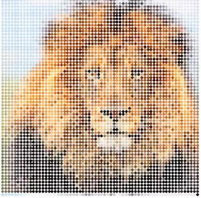

This was a final project created for ICS 111. In this project me and my group members created a program which would take a picture and transform it into a single circle. But, upon user interaction with the cursor, the circle would split and would continue splitting depending on where the cursor was. The picture should slowly form and become visible once the circles become small enough. There were many obstacles to this project. One obstacle was that the circles were not splitting into small enough circles so that the image would become noticeable. Another was the split time, as more and more circles were created, the program would run slowler and slower. But, my group was able to successfully overcome these obstacles and create it into what is today. This project was created to demonstrate our ability to code in java and show what we have learned in our ICS class. 
