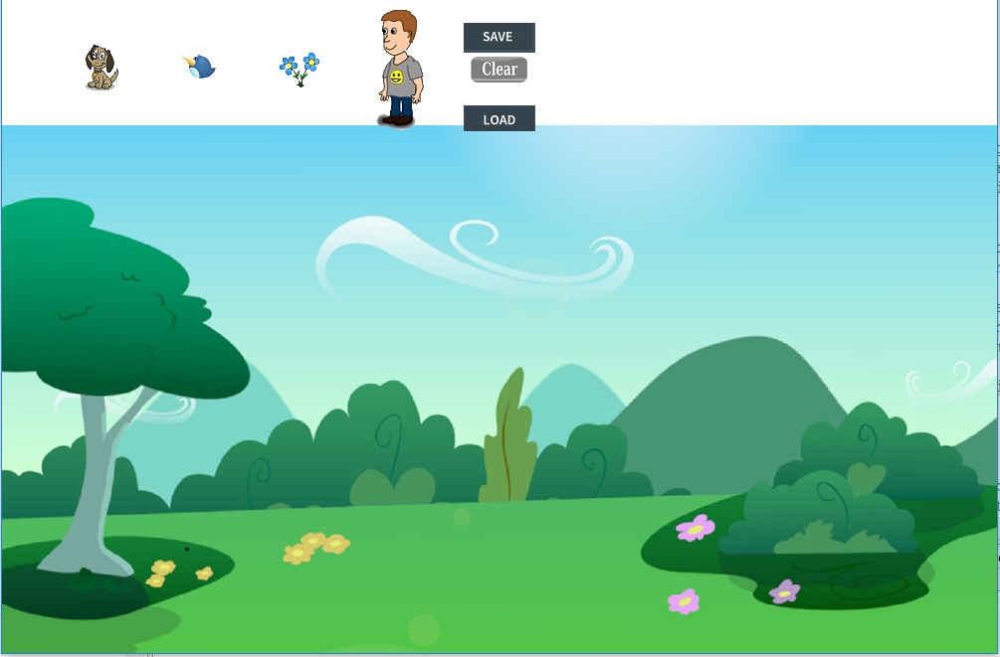

In this project, I created a program that had four images that would act as a sticker. These four images could be duplicated and pasted
anywhere on the screen where it would stay there similar to how a real life sticker book would function. Upon pasting, the "sticker" would
play a sound as well. Each sticker could be replicated anywhere in the background and after the user is satisfied they can save it. Once
the user returns to the program they would be able to load a previous version they had created. If the user is unsatisfied with what they
had a created then they could simply clear the screen.
  
This project was one of the very first projects I did involving java and it was a very good learning experience. Through this experience I learned a lot about the importance of pseudo code. Pseudo code helped me plan out what I wanted to do in the program and after planning these steps it helped vastly in putting those words into code. I also learned from this project how to use the java api and use them within the new methods I created. Being that this was one of my first programs, it was not incredibly complicated but it helped demonstrate my initial understanding of java pretty well.
