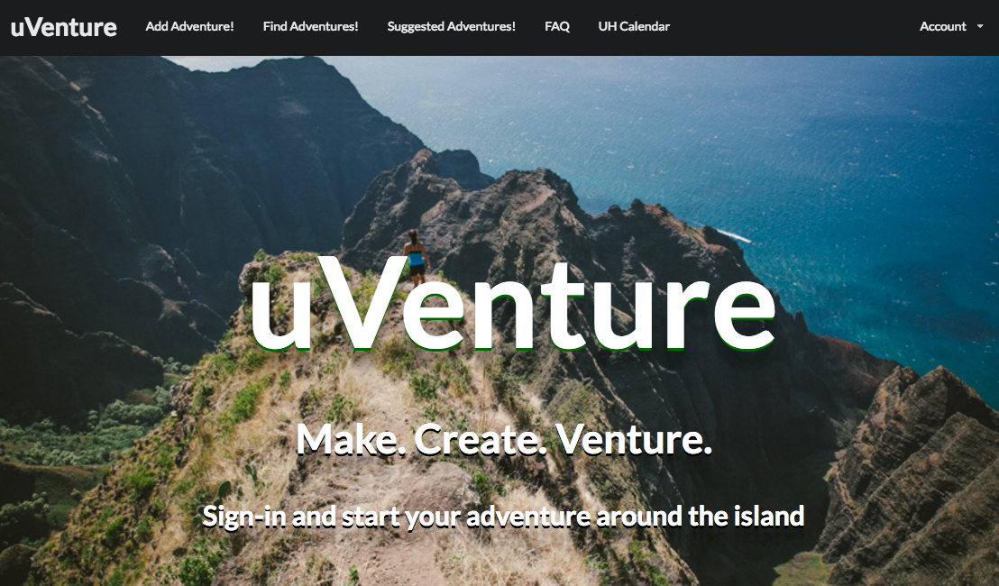
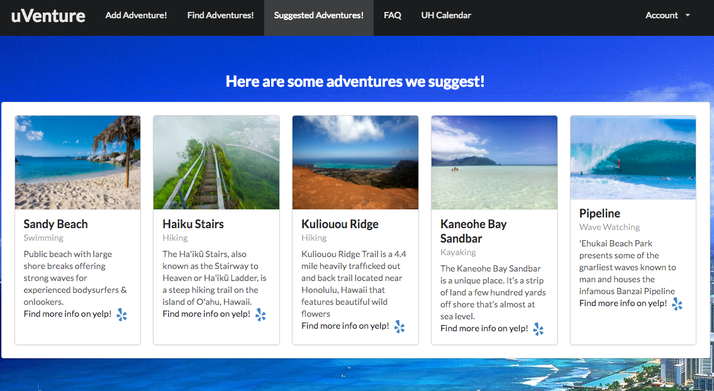

 The website uVenture was created by Jason Leong, Christopher Nguyen, and Brian Mayashiro. This website was created for ICS 314, Software 
Engineering. The goal of the website was to connect the UH community by creating a website that can organize different types of 
adventures in Hawaii. The website features functions such as add adventure, edit adventure, find adventure, and suggestions. Adding an
adventure allows users to mark the location on google maps and also place the name, organizer name, time, picture, description and type
of adventure. The project was to practice everything we learned in ICS 314. Using IntelliJ we used the bowfolios template built on
MongoDB. Having learned Javascript, HTML, and CSS, this website needed to successfully conduct all the functionalities that were
previously mentioned while communicating with the database in order to provide input and output data. 

 This website also taught me and my team how to develop a website as a team. There was a lot of group effort involved to make the 
website into what it is today. All file commits were done through Github and each portion of the website was done through individual
branches which needed to be merged into master. A lot of communication was neccessary to make sure all the commits were going through
and that no conflicts would emerge in master. In addition to meeting two times a week in class, my group met once a week outside of 
class to discuss the progress of the project and what issues needed to be resolved over the week. I think as a group we demonstrated
a strong understanding of how to work as a team and take on responsibilities while keeping everyone in the loop 

 In the end, the final website was evaluated through five testers who were given an evaluation form to fill out in order to provide
feedback into what was the good and the bad of the website. These questions and its responses would help give the feedback necessary to better 
improve upon our goals for the site. Following all the responses, it seemed that most users liked the design of the website but one also felt 
skeptical about the site being able to gather the UH community together and create adventures for everyone. These reviews will help
shape the development of the website in the future. 

